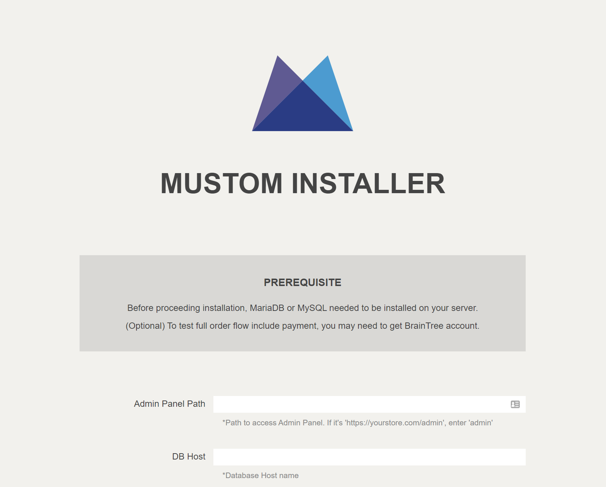

# Install Nginx

Node.js can run ... without Nginx. But Mustom designed to run along with Nginx. The reason that Mustom use Nginx is written below.


Update APT(Advance Packging Tools)

```
sudo apt update
```


Install Nginx using following command

```
sudo apt install nginx
```


After the installation is complete, you can check it was installed successfully and see the installed version.

```
nginx -v

// Output
nginx version: nginx/1.18.0 (Ubuntu)
```


Ubuntu should enable and start it automatically. You can confirm that the nginx service is up and running through the command below:

```
sudo systemctl status nginx
```


You can now open your server's IP address in the browser to verify that everything is working. You should see the default NGINX landing page:




If you cannot install NGINX successfully using the method described above, try the alternative procedures listed on the [NGINX installation guide](https://www.nginx.com/resources/wiki/start/topics/tutorials/install/) and ensure that you're able to install NGINX before proceeding.


