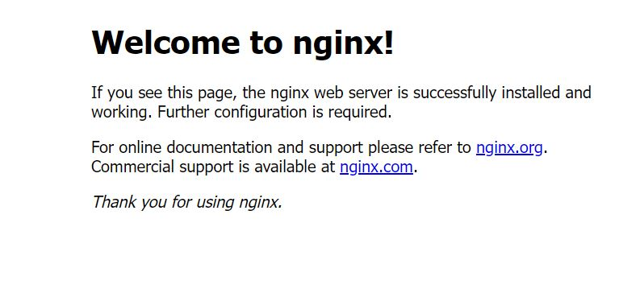

# Install Nginx

Node.js can run without Nginx. However, Mustom designed to run along with Nginx as a reverse proxy. (It is not recommended to run Mustom without NginX)


Update APT(Advance Packging Tools)

```
sudo apt update
```


Install Nginx using following command

```
sudo apt install nginx
```


After the installation is complete, you can check it was installed successfully and see the installed version.

```
nginx -v

// Output
nginx version: nginx/1.18.0 (Ubuntu)
```


At the end of the installation process, Ubuntu starts Nginx. You can confirm that the nginx service is up and running through the command below.

(By default, Nginx is configured to start automatically when the server boots)

```
sudo systemctl status nginx
```


Open your browser, and enter your server's IP address. Everything is OK, you will see the page below.

<figure><figcaption></figcaption></figure>


If you cannot install NGINX successfully using the method described above, try the alternative procedures listed on the [NGINX installation guide](https://www.nginx.com/resources/wiki/start/topics/tutorials/install/) and ensure that you're able to install NGINX before proceeding.


