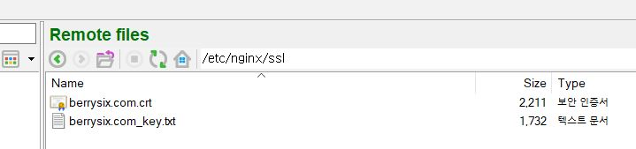

# Install Nginx


> Node.js can run without Nginx. However, Mustom designed to run along with Nginx as a reverse proxy. (It is not recommended to run Mustom without NginX)


## Installation (Ubuntu)


Step 1. Update APT

```
sudo apt update
```


Step 2. Install Nginx using following command

```
sudo apt install nginx
```


Step 3. After the installation is complete, you can check it was installed successfully and see the installed version.

```
nginx -v

// Output
nginx version: nginx/1.18.0 (Ubuntu)
```


STEP 4. At the end of the installation process, Ubuntu starts Nginx. You can confirm that the nginx service is up and running through the command below.

(By default, Nginx is configured to start automatically when the server boots)

```
sudo systemctl status nginx
```


Step 5. If you're running a system firewall,  allow access to Nginx.

```
sudo ufw allow 'NGINX Full'
```


Step 6. Open your browser, and enter your server's IP address. Everything is OK, you will see the page below.

<figure><figcaption></figcaption></figure>


If you cannot install Nginx successfully using the method described above, try the alternative procedures listed on the [Nginx installation guide](https://www.nginx.com/resources/wiki/start/topics/tutorials/install/) .



## Configuring Reverse Proxy and SSL/TLS Certificate



Please check [official guide](https://docs.nginx.com/nginx/deployment-guides/load-balance-third-party/node-js/) for detailed instruction.



Step 1. Create folder 'ssl' for SSL/TLS cert files under '/etc/nginx',  if it is not exist

```
cd /etc/nginx
mkdir ssl
```


Step 2. Copy your cert files on 'etc/nginx/ssl' folder

<figure><figcaption></figcaption></figure>


Step 3. Move to conf.d folder&#x20;

```
cd /etc/nginx/conf.d
```


Step 4. Download basic configuration file, or enhanced configuration file.

```
// Basic configuration
curl https://www.nginx.com/resource/conf/nodejs-basic.conf > nodejs-basic.conf

// Enhanced configuration
curl https://www.nginx.com/resource/conf/nodejs-enhanced.conf > nodejs-enhanced.conf
```


Step 5. Edit configuration file

```
...
 
upstream nodejs {
    # Use IP Hash for session persistence
    ip_hash;
 
    # List of Node.JS Application Servers
    
    // Node.js IP and ports here
    server 139.162.70.64:3000;
    server 139.162.70.64:3001;
}
 
	 
server {
    listen 80;
    
    // Your domain name here
    server_name berrysix.com;

    # Redirect all HTTP to HTTPS
    location / {	
		return 301 https://$server_name$request_uri;
    } 
}
 
server {
    listen 443 ssl http2;
    // Your domain name here
    server_name berrysix.com;

    // Your SSL/TLS cert file location here
    ssl_certificate     /etc/nginx/ssl/berrysix.com.crt;
    ssl_certificate_key  /etc/nginx/ssl/berrysix.com_key.txt;
    ssl_session_cache	shared:SSL:1m;
    ssl_prefer_server_ciphers  on;
 
 ...
```


Step 6. Test configuration file

```
nginx -t

// OUTPUT
nginx: the configuration file /etc/nginx/nginx.conf syntax is ok
nginx: configuration file /etc/nginx/nginx.conf test is successful
```


Step 7. Reload updated configuration

```
nginx -s reload
```


## Advanced Configuraion
